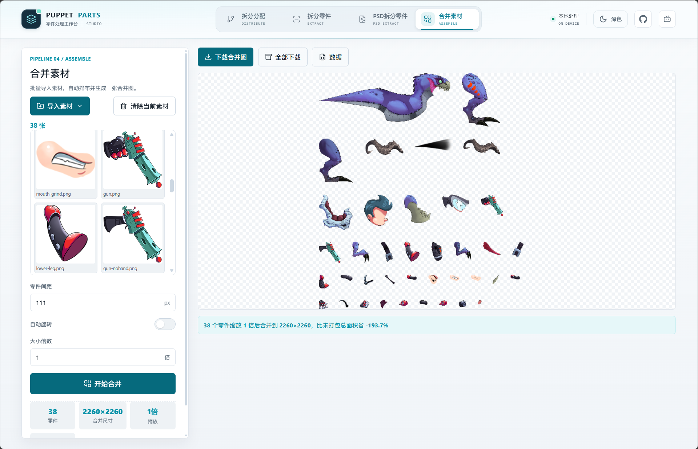
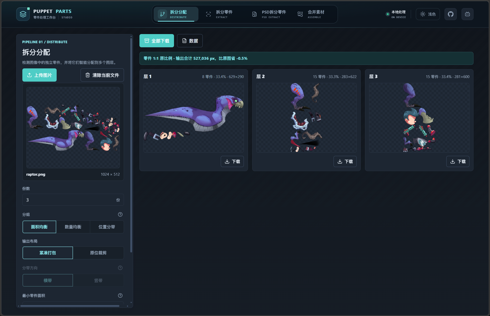
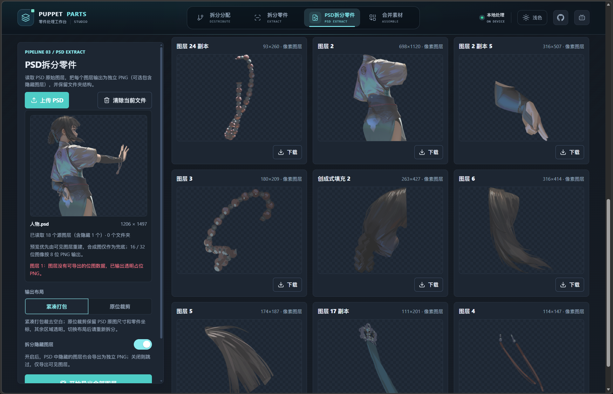
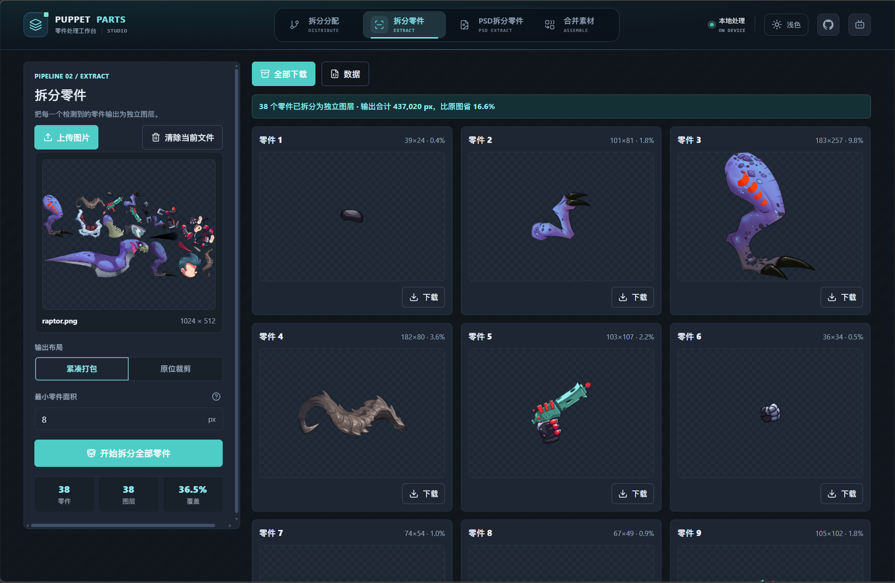

# Puppet Parts Studio

English | [简体中文](README.zh-CN.md)

A fully client-side asset processing workbench that splits illustrations, images, or PSD files into usable part layers, and automatically packs multiple transparent assets into a single sheet. All parsing, splitting, merging, and exporting happen locally in your browser — nothing is uploaded to a server.

## Screenshots

<table>
  <tr>
    <td align="center"></td>
    <td align="center"></td>
  </tr>
  <tr>
    <td align="center"></td>
    <td align="center"></td>
  </tr>
</table>

## Who Is This For

 **Wallpaper Engine** animated wallpapers — the transparent PNGs it exports are ready for parallax, puppet rigging, breathing, or rotation effects.
 **Live2D / Spine skeletal animation** — use it to quickly extract bindable part layers from character illustrations, saving time on manual outlining and one-by-one cropping.
 **Adobe After Effects** motion graphics compositing — batch-exported layered PNGs drop straight onto your timeline.
 **Unity / Godot / Unreal** game development — the auto-packed sheet and JSON coordinate data work as a Sprite Atlas out of the box.
It also serves as a lightweight alternative to **Photoshop's "Export Layers to Files"** — batch-export PSD layers to PNG without opening Photoshop at all.

## Features

### Split & Distribute

- Upload or drop PNG / JPG / WEBP images.
- Automatically detects connected parts on transparent backgrounds.
- Outputs multiple layers based on a configurable count.
- Three grouping modes: area balance, count balance, and directional bands.
- Two output layouts: compact packing and in-place cropping.
- Preview individual layers, download all PNGs, and export a JSON manifest.

### Extract All Parts

- Detects and exports every connected part as an individual layer.
- Configurable minimum part area to filter noise and small fragments.
- Supports compact packing and in-place cropping layouts.
- Batch download all parts and the data manifest as a ZIP.

### PSD Layer Extraction

- Upload or drop `.psd` / `.psb` files.
- Reads original PSD layers and exports each as an independent PNG.
- Optionally includes hidden layers.
- Compact packing trims empty space; in-place cropping preserves original canvas size and layer coordinates.
- Rebuilds preview from visible layers first, and preserves the PSD's folder structure.

### Merge Assets

- Select multiple image files or import an entire folder.
- Auto-trims transparent edges and packs into a near-square layout.
- Adjustable gap, scale multiplier, and optional auto-rotation.
- Download the merged image, all source assets, and packing data.

### Interface & Privacy

- Light and dark theme toggle.
- All assets are processed entirely in your browser — ideal for local or unreleased content.

## Requirements

- Node.js 18 or higher (LTS recommended).
- A modern browser such as the latest Chrome, Edge, Firefox, or Safari.
- The "Select Folder" feature works best in browsers that support the File System Access API; unsupported browsers fall back to file selection.

## Getting Started

There are two ways to start the project:

### Option 1: Double-click (Windows recommended)

Double-click the `start.cmd` file in the project root. The script automatically:

1. Checks if `node_modules` exists; runs `npm install` if not.
2. Checks if port 5173 is already in use; opens the browser directly if so.
3. Opens your browser to the app on first launch.

Close the terminal window when you're done to stop the server.

### Option 2: Command line

For manual control, run in the project root:

```bash
npm install
```

Then start the dev server:

```bash
npm run dev
```

Vite will display the local URL, typically:

```text
http://127.0.0.1:5173/
```

## Production Build

```bash
npm run build
```

Output goes to the `dist/` directory.

## Preview Build Locally

```bash
npm run preview
```

## Project Structure

```text
.
├─ src/
│  ├─ index.html        # Page structure and four feature panels
│  ├─ main.js           # Split, PSD parsing, merge, export & interaction logic
│  └─ style.css         # UI styles and theme
├─ dist/                # Build output
└─ package.json
```
